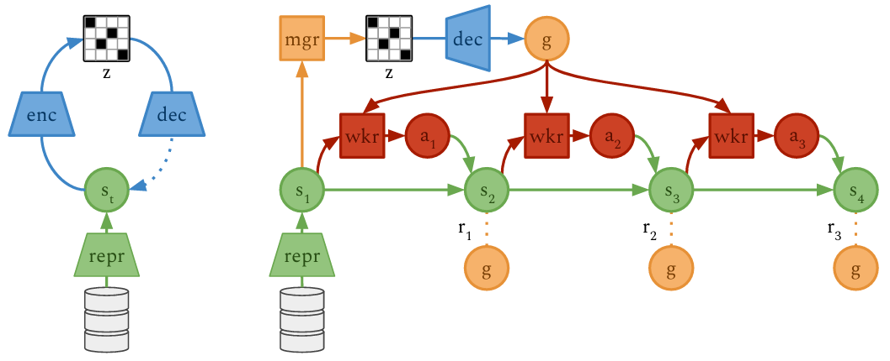

# Deep Hierarchical Planning: A PyTorch Reimplementation

[](https://pytorch.org/)
[](https://python.org)
[](https://wandb.ai/)
[](https://opensource.org/licenses/MIT)

A complete PyTorch reimplementation of **"Deep Hierarchical Planning from Pixels"** (NeurIPS 2022), a hierarchical reinforcement learning framework that enables efficient long-horizon task planning through a two-level hierarchy of manager and worker policies.

## 📖 Paper Abstract

This implementation reproduces the hierarchical reinforcement learning architecture from the Director paper, where:
- A **high-level manager** sets subgoals at a coarse temporal scale
- A **low-level worker** executes actions to achieve these subgoals  
- A **world model** learns environment dynamics for imagination-based planning
- A **goal autoencoder** provides a structured goal representation space

The original paper demonstrates that Director outperforms exploration methods on tasks with sparse rewards, including 3D maze traversal with a quadruped robot from egocentric camera inputs, without access to global position information.

## 🚀 Features

- **Full PyTorch Implementation**: Complete reimplementation of the original Director paper
- **Hierarchical Architecture**: Manager-worker decomposition for long-horizon tasks
- **Model-Based Planning**: Recurrent State Space Model (RSSM) for imagination-based trajectory simulation
- **Automatic Goal Discovery**: Goal autoencoder with discrete categorical representations
- **Interpretable Goals**: Latent goals can be decoded into images for visualization
- **Experiment Tracking**: Integrated with Weights & Biases for comprehensive logging
- **Modular Design**: Clean, extensible codebase with separate components
- **Reproducibility**: Config-based training with complete checkpointing

## 🏗️ Architecture Overview



**Key Components:**
- **RSSM World Model**: Learns environment dynamics in latent space
- **Goal Autoencoder**: Compresses states into discrete categorical representations  
- **Manager Policy**: Selects subgoals every K=8 steps using discrete codes
- **Worker Policy**: Executes primitive actions to achieve decoded goals
- **Max-Cosine Reward**: Measures goal achievement while encouraging magnitude matching

## 📦 Installation

### Prerequisites

- Python
- PyTorch

### Install from source

```bash
# Clone the repository
git clone https://github.com/your-username/deep-hierarchical-planning.git
cd deep-hierarchical-planning

# Install dependencies
pip install -r requirements.txt
```

## 🎯 Usage

### Training

```bash
python scripts/train.py
```

### Configuration

The training is configured through YAML files:

```yaml
# configs/default.yaml
environment:
  task: "three"
  length: 100

model:
  latent_dim: 1024
  hidden_dim: 512
  action_dim: 4
  goal_classes: 8
  goal_codes: 8

training:
  K: 8                  # Manager step frequency
  E: 16                 # Learning frequency
  horizon: 32           # Imagination horizon
  gamma: 0.99           # Discount factor
  w_extrinsic: 1.0      # Extrinsic reward weight
  w_exploration: 0.1    # Exploration reward weight
  max_episodes: 10000
  save_interval: 100
```

## 🧠 Core Components

### World Model (`src/dhp/models/world_model.py`)
```python
class RSSM(nn.Module):
    def __init__(self, action_dim, obs_dim, latent_dim, hidden_dim):
        # Representation model: reprθ(s_t | s_{t-1}, a_{t-1}, x_t)
        # Dynamics model: dynθ(s_t | s_{t-1}, a_{t-1})  
        # Decoder: recθ(s_t) ≈ x_t
        # Reward predictor: rewθ(s_{t+1}) ≈ r_t
```

### Goal Autoencoder (`src/dhp/models/goal_autoencoder.py`)
```python
class GoalAutoencoder(nn.Module):
    def __init__(self, input_dim):
        # Encoder: encφ(z | s_t) - 8×8 categorical matrix
        # Decoder: decφ(z) ≈ s_t - reconstructs state from discrete codes
```

### Manager Policy (`src/dhp/models/manager_policy.py`)
```python
class ManagerPolicy(nn.Module):
    def __init__(self, latent_dim, code_size, num_codes):
        # Selects goals in discrete code space every K=8 steps
        # Maximizes task reward + exploration bonus
```

### Worker Policy (`src/dhp/models/worker_policy.py`)  
```python
class WorkerPolicy(nn.Module):
    def __init__(self, latent_dim, goal_dim, action_dim):
        # Goal-conditioned policy that executes primitive actions
        # Maximizes max-cosine similarity to current goal
```

## 📁 Project Structure

```
deep-hierarchical-planning/
├── src/dhp/                    # Main package
│   ├── models/
│   │   ├── world_model.py      # RSSM with representation/dynamics models
│   │   ├── goal_autoencoder.py # Discrete state compression
│   │   ├── manager_policy.py   # High-level goal selection
│   │   └── worker_policy.py    # Low-level action execution
│   ├── agents/
│   │   └── hrl_agent.py        # Main agent coordinating all components
│   ├── utils/
│   │   ├── logger.py           # Weights & Biases integration
│   │   ├── replay_buffer.py    # Experience replay
│   │   ├── imagine_trajectory.py # Latent space planning
│   │   └── policy_utils.py     # Return normalization & discounting
│   │   └── yaml_parser.py     # Load and parse configs file
│   └── environments/
│       └── wrappers.py         # Environment adapters
├── scripts/
│   └── train.py               # Main training script
├── configs/                   # Configuration files
└── outputs/                   # Training outputs (not versioned)
    └── checkpoints/          # Model checkpoints
```


## 🔧 Customization

### Adding New Environments

1. Create a new environment wrapper in `src/dhp/environments/`
2. Update the configuration file with appropriate observation/action dimensions
3. Implement any environment-specific preprocessing

## 📊 Expected Results

This implementation reproduces the key results from the Director paper:

- **Sparse Reward Tasks**: Solves long-horizon tasks with very sparse rewards
- **Visual Pin Pad**: Discovers correct sequences in multi-pad environments
- **Interpretable Goals**: Latent goals decode to meaningful image subgoals

## 📄 License

This project is licensed under the MIT License - see the [LICENSE](LICENSE) file for details.

## 📚 Citation

If you use this implementation in your research, please cite the original paper:

```bibtex
@inproceedings{hafner2022deep,
  title={Deep Hierarchical Planning from Pixels},
  author={Hafner, Danijar and Lee, Kuang-Huei and Fischer, Ian and Abbeel, Pieter},
  year={2022}
}
```
---

**Note**: This is a reimplementation created as a course project in a master's degree program at Sorbonne Université for educational purposes. For exact reproduction of original results, please refer to the official implementation from the paper authors.

*For questions or discussions about this implementation, please open an issue on GitHub.*